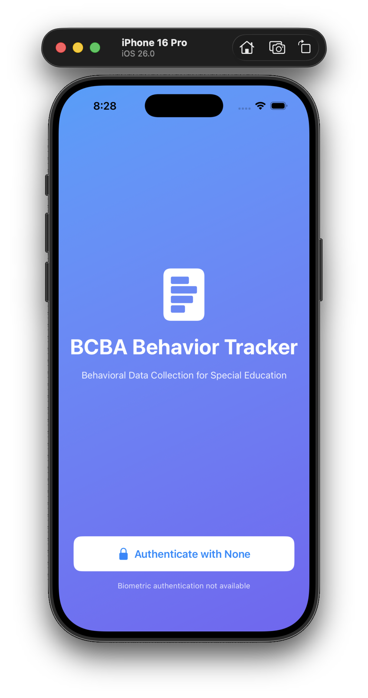
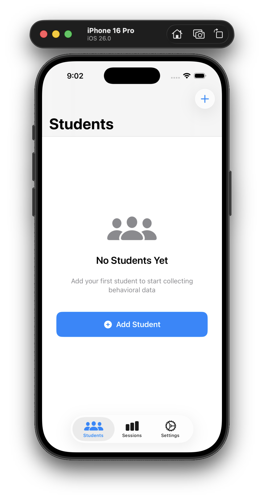

  

  
  

# BCBA Behavior Tracker

A native iOS application for Board Certified Behavior Analysts (BCBAs), teachers, and Registered Behavior Technicians (RBTs) to collect and analyze behavioral data for special needs students.

## Overview

BCBA Tracker streamlines real-time behavioral data collection with an offline-first architecture, biometric security, and personal Google Drive backup integration. Built specifically for classroom environments where quick, reliable data entry is critical.

## Key Features

- **Six ABA Data Collection Methods**: Frequency, Duration, ABC, Interval, DTT, and Task Analysis
- **Offline-First**: All features work without network connectivity
- **Biometric Security**: Face ID/Touch ID authentication with data encryption
- **Privacy by Design**: Minimal PII storage (first name + last initial only)
- **Google Drive Backup**: Manual backup/restore to user's personal Google Drive
- **iPad Optimized**: Large touch targets and haptic feedback for classroom use
- **Swift Charts**: Real-time progress visualization and trend analysis

## Technology Stack

- **Platform**: iOS 17.0+ (iPhone and iPad)
- **Language**: Swift 5.9+
- **UI**: SwiftUI with native iOS components
- **Data**: Core Data for local persistence
- **Cloud**: Google Drive API for user-controlled backups
- **Security**: CryptoKit encryption + LocalAuthentication

## Architecture

Built with an offline-first approach where Core Data serves as the source of truth. Google Drive integration provides optional manual backup/restore, giving users complete control over their data. All student information is encrypted at rest and requires biometric authentication.

## Development Status

**Phase**: Active Development (Phase 3 - Cloud Backup Integration)
**Target**: 12-week development cycle
**Platform**: Native iOS (no cross-platform frameworks)

## Getting Started

1. Clone the repository
2. Open `BCBATracker.xcodeproj` in Xcode 15+
3. Build and run on iOS Simulator or device
4. See `CLAUDE.md` for detailed development guidelines

## Compliance

- **FERPA**: Minimal PII, encrypted storage, audit logging
- **COPPA**: No student accounts, no advertising, teacher-managed data
- **Accessibility**: VoiceOver support, WCAG AA contrast, Dynamic Type

## License

Proprietary - All rights reserved

---

*Developed for special education professionals who need reliable, secure behavioral data collection in classroom settings.*
